# Исследование оптимизаций кода на примере хеш-таблицы

## Введение

Целью данного проекта является:
1. Исследовать заселенность хеш-таблицы для определенного набора хеш-функций и выбрать с наилучшим распределением
2. Оптимизировать несколько участков кода хеш-таблицы

## Скачивание и установка проекта

Для установки программы используются утилиты `make` и `git`.

```CMAKE
    git clone git@github.com:EntryFrager/HashTable.git
    cd HashTable
    make
    ./HashTable.exe
```

Для выполнения разных частей проекта были написаны две отдельные функции `test_first_part()` и `test_second_part()`. Ознакомиться с ними подробнее вы сможете ниже, в описаниях для каждой частей работы.

> [!IMPORTANT]
>
> Данная программа предназначена для работы на процессорах поддерживающих AVX\AVX2 инструкции (Advanced Vector Extensions).

## Немного про хеш-таблицы

Хеш-таблица — структура данных, реализующая интерфейс ассоциативного массива, а именно, она позволяет хранить пары (ключ, значение) и выполнять три операции:

1. Операцию добавления новой пары
2. Операцию удаления
3. Операцию поиска пары по ключу.

Построение хеш-таблицы состоит из трех частей: хеш-функция, преобразование хеша в индекс и обработка коллизий. Сначала давайте рассмотрим, что такое "хорошая" хеш-функция.

### Хорошая хеш-функция

Хеш-функция - функция, осуществляющая преобразование массива входных данных произвольной длины в выходную битовую строку установленной длины, выполняемое определённым алгоритмом. Преобразование, производимое хеш-функцией, называется хешированием. Простыми словами: хеш-функция - это метод, который берет любой объект и вычисляет почти уникальное числовое представление объекта, которое может быть использовано в качестве ключа для последующего поиска.

Хорошая хеш-функция работает быстро. Она дает хорошее равномерное распределение чисел и минимизирует коллизии.

Теоретически, мы можем взять хеш-код, который вычислили, и использовать его в качестве индекса для поиска. Но с этим есть одна проблема. Размер нашей хеш-таблицы имеет ограниченный размер, и в какой-то момент полученный хеш будет выходить за границы нашего массива. Для этого следует взять остаток от деления на размер хеш-таблицы.

Если мы собираемся взять большое количество хеш-кодов и сократить их до меньшего индекса, то неизбежно возникнут коллизии. Давайте посмотрим, как мы справляемся с коллизиями в хеш-таблице.

### Борьба с коллизиями

Коллизией в хеш-таблице называется случай, когда хеши двух различных элементов оказываются равными, и они записываются в одну и ту же ячейку.

Существует несколько решений данной проблемы: метод цепочек и метод двойного хеширования. В данном проекте мы используем метод цепочек, поэтому рассмотрим только его. Про метод двойного хеширования можно прочитать [здесь](https://habr.com/ru/articles/509220/).

#### Метод цепочек

В этом случае каждая ячейка таблицы хешей содержит связанный список всех элементов, которые получаются с помощью той же функции хеширования. Если возникает коллизия, новый элемент добавляется в этот связанный список.

### Преимущество хеш-таблиц

Благодаря использованию хеш-функции, хеш-таблица позволяет быстро находить нужный элемент по ключу. Время доступа к элементу в хеш-таблице почти не зависит от размера таблицы, что делает ее очень эффективной для поиска данных `O(1)`. Если все же имеются коллизии, то для поиска элемента нужно будет пройтись по списку. В худшем случае это может быть `O(n)`.

> [!NOTE]
>
> Более подробно про хеш-таблицы вы можете прочитать [здесь](https://ru.wikipedia.org/wiki/%D0%A5%D0%B5%D1%88-%D1%82%D0%B0%D0%B1%D0%BB%D0%B8%D1%86%D0%B0).

## Статистические данные для хеш-таблиц

Будем считать хеш-функцию идеальной, если она дает равномерное распределение, и во всех списках хеш-таблицы будет одинаковое количество элементов.

Пусть $Index[m]$ – хеш-таблица с $m$ позициями, в которую занесено $n$ пар (key, value). Отношение $\alpha = \frac {n} {m}$ называется коэффициентом заполнения хеш-таблицы. Данный коэффициент показывает, сколько будет коллизий в каждом списке хеш-таблицы для идеальной хеш-функции.

Коэффициент заполнения $\alpha$ позволяет судить о качестве хеш-функции: пусть $M = \frac {1} {m} \Sigma_ {i = 0} ^ {m} |len(Index[i])|$– средняя длина списков; если `hash(key)` – "хорошая" хеш-функция, то дисперсия $D = \frac {1} {m} \Sigma_ {i = 0} ^ {m - 1} (|M - *Index[i]|) ^ 2 \leq \alpha$. Другими словами, дисперсия есть среднее отклонение длины списков от идеального значения. И мы считаем, что, если дисперсия будет меньше идеального значения количества коллизий для одного списка, то наша хеш-функция - "хорошая".

> [!NOTE]
>
> Данная информация взята с этого [сайта](http://algcourse.cs.msu.su/wp-content/uploads/2010/12/Lect13.pdf).

## Первая часть работы

В первой части работы мы будем исследовать статистические данные хеш-таблицы для различных хеш-функций. Для исследования заселенности хеш-таблицы были взяты хеш-функции, которые в качестве хеша возвращали:

1. Ноль
2. ASCII код первой буквы слова
3. Длину слова
4. Сумму всех ASCII кодов букв(контрольная сумма)
5. Частное контрольной суммы и длины слова
6. Функция, rotate right
7. Функция, rotate left
8. Хеш-функция - `crc32`

Для тестирования хеш-функций была написана отдельная функция `test_first_part()`. На вход подается имя файла с данными и массив структур `ResearchHashFunc`, который содержит информацию о хеш-функциях и о хеш-таблице.

```C
typedef struct {
    const char *hash_func_name = NULL;
    const hash_func_t hash_func = NULL;

    const int hash_table_size = 0;
} ResearchHashFunc;
```

```C
void test_first_part (const char *file_name, ResearchHashFunc *research_hash_func, size_t n_hash_func, int *code_error)
{
    my_assert(file_name != NULL, ERR_PTR);
    my_assert(research_hash_func != NULL, ERR_PTR);

    size_t len_data = 0;

    char **data = input_data(file_name, &len_data, code_error);
    ERR_RET();

    for (size_t i = 0; i < n_hash_func; i++)
    {
        HashTable hash_table = {};
        hash_init(&hash_table, research_hash_func[i].hash_func, research_hash_func[i].hash_table_size, code_error);
        ERR_RET();

        hash_filling(&hash_table, data, len_data, code_error);
        ERR_RET();

        make_plot(&hash_table, research_hash_func[i].hash_func_name, code_error);
        ERR_RET();

        StatisticsHashTable stat_hash_table = {};
        get_statistic_hash_table(&hash_table, &stat_hash_table, research_hash_func[i].hash_func_name, code_error);
        ERR_RET();

        print_statistic_hash_table(&stat_hash_table, stdout, code_error);

        hash_destroy(&hash_table, code_error);
        ERR_RET();
    }

    free_ptr_dyn_mem();
}
```

Для заполнения хеш-таблицы был взят текст "Евгения Онегина" на английском языке, из которого были удалены все знаки препинания и который был разбит на отдельные слова. Всего слов было `14379`, уникальных из них `3473`.

Load фактор для всех функций был одинаковым и его значение было равно `7.2`.

Ниже приведены графики, отображающие зависимость количества коллизий от номера ячейки.

### 1. Функция, возвращающая ноль

```C
hash_t nul_hash_func (const hash_elem_t elem, int *code_error)
{
    my_assert(elem != NULL, ERR_PTR);

    return 0;
}
```

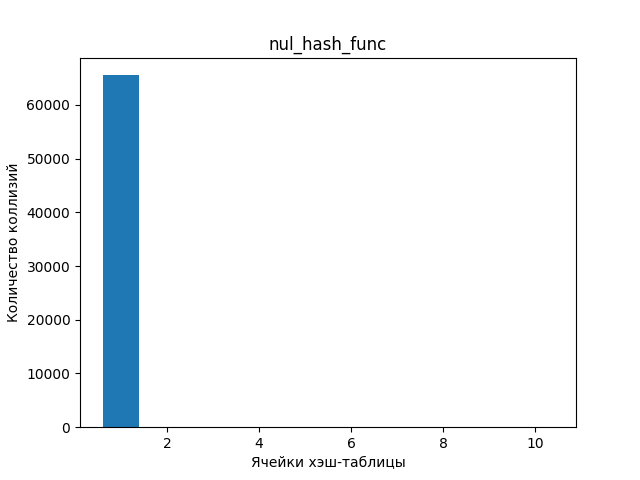

Все наши слова попали в первую ячейку. На графике это показано соответствующей пикой в нуле. Данное распределение является крайне неэффективным, так как для обработки элемента из данной хеш-таблицы потребуется O(n). Такая хеш-таблица ничем не отличается от обычного массива.

### 2. Функция, возвращающая ASCII код первой буквы слова

```C
hash_t ascii_code_hash_func (const hash_elem_t elem, int *code_error)
{
    my_assert(elem != NULL, ERR_PTR);

    return (hash_t) *elem;
}
```

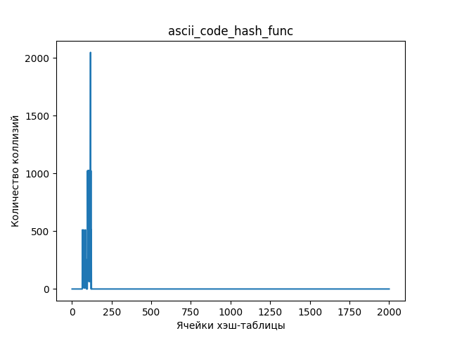

Из графика видно, что наши слова распределились между ячейками от `65`('A') до `122`('z'). Данная хеш-функция не дает нам желаемого результата, так как данное распределение не сильно отличается от первой хеш-функции.

### 3. Функция, возвращающая длину слова

```C
hash_t len_word_hash_func (const hash_elem_t elem, int *code_error)
{
    my_assert(elem != NULL, ERR_PTR);

    return strlen(elem);
}
```

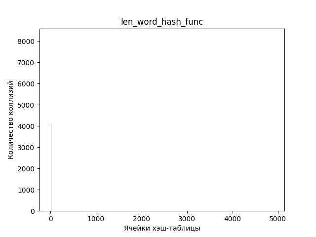

Из графика видим пику в самом начале. Это обосновано тем, что длины всех слов не больше `20`, и все слова располагаются в первых `20` ячейках. Данная хеш-функция не является "хорошей", так как понятно, что среднее отклонение длины списков от идеального значения сильно больше коэффициента заполнения хеш-таблицы.

### 4. Функция, возвращающая контрольную сумму

```C
hash_t control_sum_hash_func (const hash_elem_t elem, int *code_error)
{
    my_assert(elem != NULL, ERR_PTR);

    hash_t control_sum = 0;

    for (size_t i = 0; elem[i] != '\0'; i++)
    {
        control_sum += elem[i];
    }

    return control_sum;
}
```

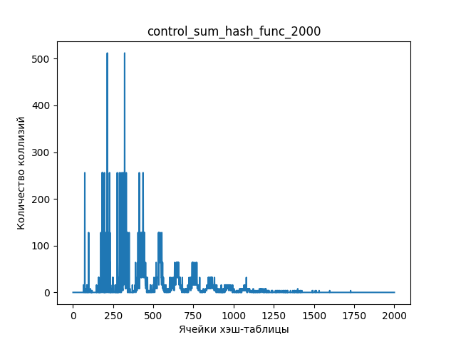

Как мы видим из графика, наши элемента расположились до `1750` ячейки. Не трудно понять, что если взять хеш-таблицу размера до `1000`, то данное распределение может показаться хорошим(для этого приведу отдельный график с размером хеш-таблицы `750`). Но стоит повысить размер до `2000-4000`, то оно тут же становится непригодным для использования. Все потому, что контрольная сумма имеет ограниченное значения для осмысленных слов (существующие слова имеют ограничение по длине, а также `ASCII` коды букв не превосходят `122` ('z')). Данное распределение лучше, чем все приведенные выше, но все также непригодно для использования.

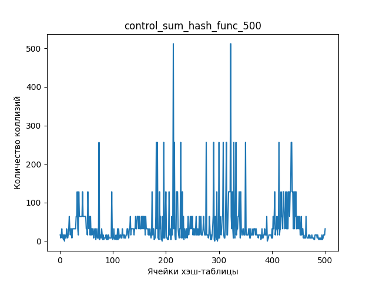

### 5. Функция, возвращающая частное контрольной суммы и длины слова

```C
hash_t average_value_hash_func (const hash_elem_t elem, int *code_error)
{
    my_assert(elem != NULL, ERR_PTR);

    return (hash_t) control_sum_hash_func(elem, code_error) / strlen(elem);
}
```

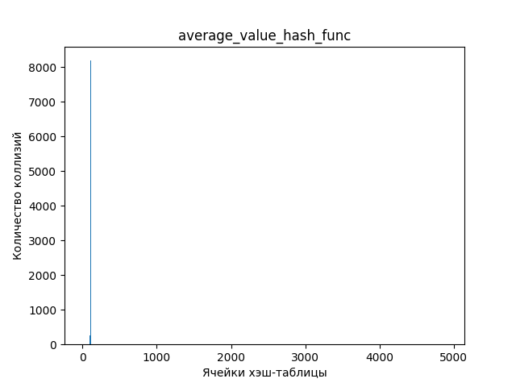

В данном распределении все слова расположились около ячейки с номером `100`. Это обусловлено тем, что контрольная сумма зависит от длины слова. Данное величина есть среднее значение. Она будет колебаться около от `65` ('A') до `122` ('z'). Данное распределение недопустимо к применению, так как поиск элемента в данной хеш-таблице будет проходить за `O(n)`.

### 6. Функция, rotate right

```C
hash_t ror_hash_func (const hash_elem_t elem, int *code_error)
{
    my_assert(elem != NULL, ERR_PTR);

    hash_t hash = 0;

    for (size_t i = 0; elem != '\0'; i++)
    {
        hash = ((hash >> 1) | (hash << 63)) ^ elem[i];
    }

    return hash;
}
```

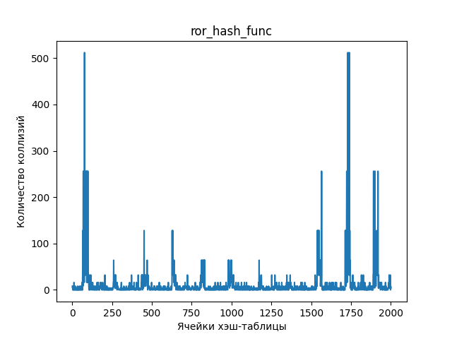

На графике видны пики в начале и конце. Данная хеш-функция недопустима к применению, из-за неравномерного распределения. Дисперсия данной хеш-функции равна `557`.

### 7. Функция, rotate left

```C
hash_t rol_hash_func (const hash_elem_t elem, int *code_error)
{
    my_assert(elem != NULL, ERR_PTR);

    hash_t hash = 0;

    for (size_t i = 0; elem[i] != '\0'; i++)
    {
        hash = ((hash << 1) | (hash >> 63)) ^ elem[i];
    }

    return hash;
}
```

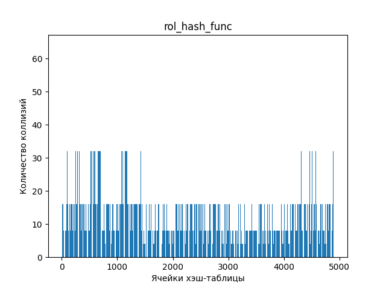

Видны две пики в начале графика. Дисперсия данной хеш-функции равна `410`. Таким образом, функция `rotate left` выдает лучшее распределение нежели функция `rotate right`.Но данное распределение все еще является недопустимым к применению.

### 8. хеш функция - `crc32`

```C
static const hash_t CRC_POLINOM = 0xEDB88320;

hash_t crc32_hash_func (const hash_elem_t elem, int *code_error)
{
    my_assert(elem != NULL, ERR_PTR);

    hash_t crc = 0xffffffff;

    for (size_t i = 0; elem[i] != '\0'; i++)
    {
        crc ^= elem[i];

        for (int bit = 0; bit < 8; bit++)
        {
            if (crc & 1)
            {
                crc = (crc >> 1) ^ CRC_POLINOM;
            }
            else
            {
                crc = crc >> 1;
            }
        }
    }

    return ~crc;
}
```

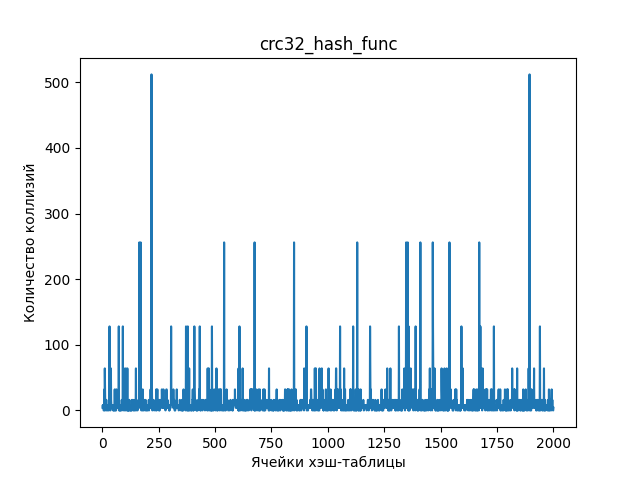

Данная хеш-функция выдает лучшее распределение среди всех рассмотренных.

### Load фактор и дисперсия хеш-функций

| Номер хеш-функции | Дисперсия |
|-------------------|-----------|
| 1                 | 103274    |
| 2                 | 4060      |
| 3                 | 15764     |
| 4                 | 544       |
| 5                 | 6441      |
| 6                 | 557       |
| 7                 | 410       |
| 8                 | 396       |

Такие большие значения дисперсии объясняются тем, что среди тех элементов, которые мы записываем в хеш-таблицу, много повторяющихся. Поэтому и такое большое количество коллизий. В дальнейшем исследовании будет использоваться хеш-функция `crc32`, так как она выдала лучшее распределение в нашем исследовании.

### Интересные факты про хеш-функции rotate right и rotate left

Воспользуемся сайтом [godbolt](https://godbolt.org/) и посмотрим на ассемблерный код данных функций. Заметим, что циклический сдвиг влево и вправо на ассемблере выполняется при помощи одной команды `rol` и `ror`. Данных функций нет в языках `C/C++`, но они есть в ассемблере. Получается, что компилятор распознает их и преобразует в одну команду.

#### Rotate right

```assembly
ror_hash_func(char*, int*):
        movsx   edx, BYTE PTR [rdi]
        test    dl, dl
        je      .L4
        add     rdi, 1
        xor     eax, eax
.L3:
        ror     eax
        add     rdi, 1
        xor     eax, edx
        movsx   edx, BYTE PTR [rdi-1]
        test    dl, dl
        jne     .L3
        ret
.L4:
        xor     eax, eax
        ret
```

#### Rotate left

```assembly
rol_hash_func(char*, int*):
        movsx   edx, BYTE PTR [rdi]
        test    dl, dl
        je      .L10
        add     rdi, 1
        xor     eax, eax
.L9:
        rol     eax
        add     rdi, 1
        xor     eax, edx
        movsx   edx, BYTE PTR [rdi-1]
        test    dl, dl
        jne     .L9
        ret
.L10:
        xor     eax, eax
        ret
```

> [!NOTE]
>
> Более подробно с кодом вы можете ознакомиться [здесь](https://godbolt.org/z/r6qYdKe8f).

 ## Вторая часть работы

Во второй части работы мы будем оптимизировать "узкие" места в нашей программе. Чтобы найти "узкие" места в нашей программе воспользуемся утилитой `KCachegrind`.

Для заполнения хеш-таблицы воспользуемся тем же самым текстом, что и в первой части работы. В качестве теста хеш-таблицы, была написана отдельная функция `test_second_part`, которая вызывает функцию поиск элемента, для всех слов нашего текста `10000` раз.

```C
void test_second_part (const char *file_name, const int hash_table_size, int *code_error)
{
    my_assert(file_name != NULL, ERR_PTR);

    HashTable hash_table = {};
    hash_init(&hash_table, crc32_hash_func, hash_table_size, code_error);
    ERR_RET();

    size_t len_data = 0;

    char **data = input_data(file_name, &len_data, code_error);
    ERR_RET();

    hash_filling(&hash_table, data, len_data, code_error);
    ERR_RET();

    uint64_t ticks = __rdtsc();

    for (size_t j = 0; j < 10000; j++)
    {
        for (size_t i = 0; i < len_data; i++)
        {
            HashElemPos hash_elem_pos = {};
            hash_find_elem(&hash_table, &hash_elem_pos, data[i], code_error);
            ERR_RET();
        }
    }

    ticks = __rdtsc() - ticks;

    printf("Number of ticks spent on search: %ld\n", ticks);

    hash_destroy(&hash_table, code_error);
    ERR_RET();

    free_ptr_dyn_mem();
}
```

Для каждой оптимизации посчитаем время выполнения программы в тиках процессора, при помощи функции `__rdtsc()`. Более подробно про данную функцию вы можете прочитать [здесь](https://man.netbsd.org/NetBSD-8.1/x86/rdtsc.9).

Будем считать ускорение при двух уровнях оптимизации компилятора `-O0` и `-O3`. В первом случае, мы покажем чистое ускорение программы без оптимизаций компилятора. Во втором случае, покажем ускорение уже для пользовательского варианта программы.

| Уровень оптимизации | Время выполнения $\cdot 10 ^ 8$|
|---------------------|--------------------------------|
|   -O0               |     750.5                      |
|   -O3               |     392.4                      |

Для начала запустим `callgrind` для не оптимизированной программы (заранее были отключены все верификаторы для списков и хеш-таблицы) и найдем "узкие" места. Ниже приведен скрин из `KCachegrind`.

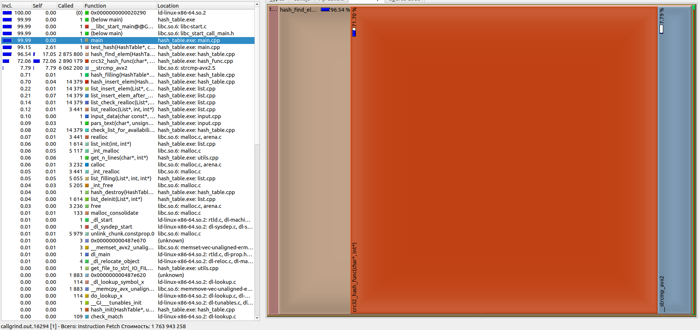

### Первая оптимизация

Не трудно увидеть, что наша хеш-функция `crc32` занимает большую часть времени выполнения. Для первой оптимизации, ускорим данную функцию. Для ее ускорения можно применить несколько вариантов улучшения данной функции:
1. Применить `SIMD` оптимизацию данной хеш-функции (`sse_crc32_hash_func`)
2. Написать данную функцию на ассемблере и вызывать ее (`asm_crc_32_hash_func`)
3. Сделать ассемблерную вставку в код (`inline_asm_crc_32_hash_func`)

Рассмотрим каждый вариант и выберем тот, что дает лучшее ускорение с применением разных уровней оптимизации.

#### Первый вариант

```C
hash_t sse_crc32_hash_func (const hash_elem_t elem, int *code_error)
{
    my_assert(elem != NULL, ERR_PTR);

    hash_t hash = 0;

    for (size_t i = 0; elem[i] != '\0'; i++)
    {
        hash = _mm_crc32_u8(hash, elem[i]);
    }

    return hash;
}
```

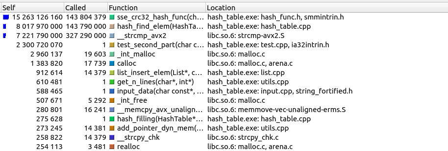

#### Второй вариант

```assembly
asm_crc32_hash_func:
    push rbp
    mov rbp, rsp

    xor rax, rax
    mov eax, 0xffffffff

    jmp .if_loop
.loop:
    crc32 eax, byte [rdi]
    inc rdi

.if_loop:
    cmp byte [rdi], 0
    ja .loop

    mov rsp, rbp
	pop rbp

    ret
```

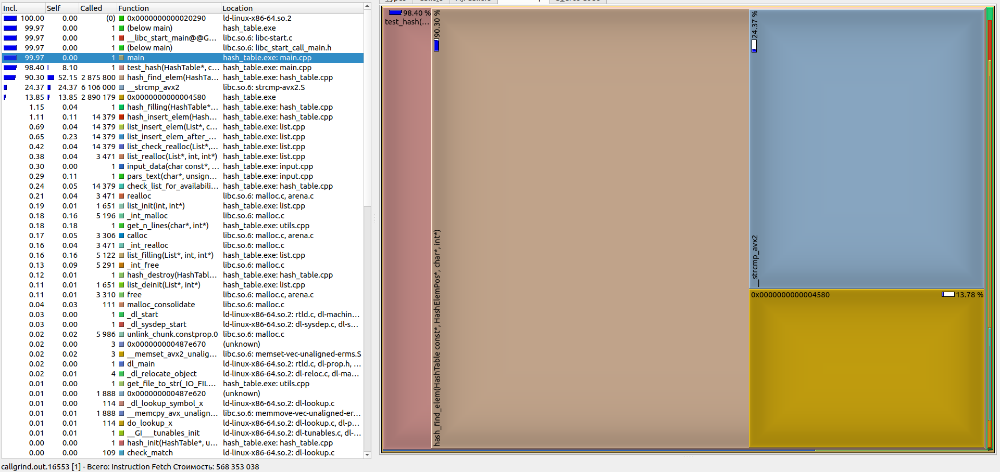

#### Третий вариант

```C
hash_t inline_asm_crc32_hash_func (const hash_elem_t elem, int *code_error)
{
    my_assert(elem != NULL, ERR_PTR);

    hash_t hash = 0;

    __asm__ ("xor rax, rax                  \n\t"
             "mov eax, 0xffffffff           \n\t"
             "jmp .if_loop                  \n\t"
             ".loop:                        \n\t"
             "crc32 eax, byte ptr [%[elem]] \n\t"
             "inc %[elem]                   \n\t"
             ".if_loop:                     \n\t"
             "cmp byte ptr [%[elem]], 0     \n\t"
             "ja .loop                      \n\t"
             "mov %[hash], eax              \n\t"
             :[hash] "=m"(hash)
             :[elem] "d"(elem)
             :"%rax");

    return hash;
}
```

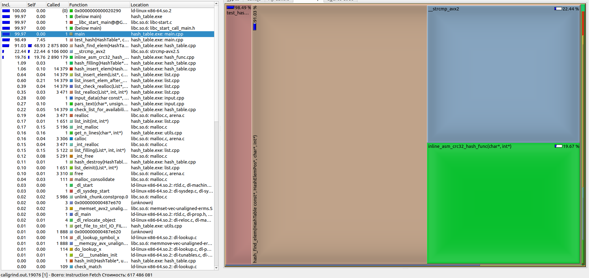

#### Итоги для первой оптимизации

Ниже приведена таблица, которая показывает время выполнения программы и ее ускорение, при разных уровнях оптимизации компилятора.

| Вариант оптимизации | Время выполнения программы  $\cdot 10^8$ (`-O0)` | Время выполнения программы $\cdot 10^8$ (`-O3`) | Ускорение (`-O0`) | Ускорение (`-O3`) |
|---------------------|--------------------------------------------------|-------------------------------------------------|-------------------|-------------------|
| `SIMD` оптимизация  |  212.5                                           |   136.8                                         |   3.53            |   2.87            |
|Функция на ассемблере|  168.9                                           |   131.8                                         |   4.44            |   2.98            |
|Ассемблерная вставка |  170.9                                           |   137.7                                         |   4.39            |   2.85            |

Из таблицы видно, что лучшее ускорение дает второй вариант. В качестве первой оптимизации возьмем хэш-функцию на ассемблере. Она дает нам ускорение в `4.4` раз относительно базовой версии, при уровне оптимизации `-O0`. А для уровня оптимизации `-O3` в `2.98` раз.

### Вторая оптимизация

После первой оптимизации, снова воспользуемся `callgrind` и найдем следующее узкое место.


Таковым является функция сравнения строк `strcmp`. Для ускорения `strcmp` рассмотрим три варианта и выберем из них наилучший:

1. Применить `SIMD` оптимизацию данной хеш-функции (`avx_my_strcmp`)
2. Написать данную функцию на ассемблере (`asm_my_strcmp`)
2. Сделать ассемблерную вставку в код (`inline_asm_my_strcmp`)

#### Первый вариант

Для `AVX` инструкций выравняем все слова по 32 байта.

```C
inline int avx_my_strcmp (const char *str_1, const char *str_2)
{
    __m256i s1 = _mm256_loadu_si256((const __m256i*) str_1);
    __m256i s2 = _mm256_loadu_si256((const __m256i*) str_2);

    return ~(_mm256_movemask_epi8(_mm256_cmpeq_epi8(s1, s2)));
}
```

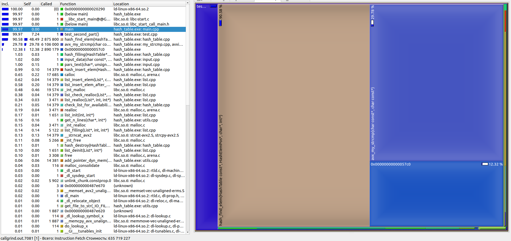

#### Второй вариант

```assembly
asm_my_strcmp:
        push rbp
        mov rbp, rsp

        vmovdqu ymm1, [rdi]
        vpcmpeqb ymm0, ymm1, [rsi]
        vpmovmskb rax, ymm0

        xor rax, 0xffffffff

        mov rsp, rbp
        pop rbp

        ret
```

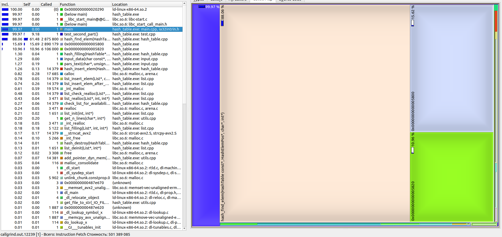

#### Третий вариант

```C
inline int inline_asm_my_strcmp (const char *str_1, const char *str_2)
{
    int result = 0;

    __asm__("vmovdqu ymm1, ymmword ptr [rdi]\n\t"
            "vpcmpeqb ymm0, ymm1, ymmword ptr [rsi]\n\t"
            "vpmovmskb %[result], ymm0\n\t"
            "xor %[result], 0xffffffff\n\t"
            :[result]"=&r"(result)
            ::"%ymm0", "%ymm1", "%rax");

    return result;
}
```

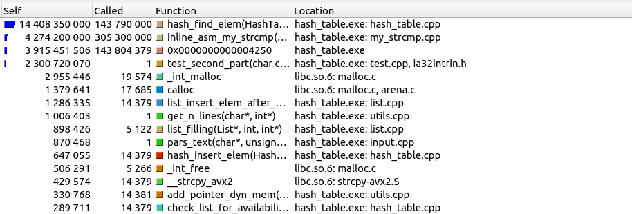

#### Итоги для второй оптимизации

Ниже приведена таблица, которая показывает время выполнения программы и ее ускорение относительно версии с оптимизацией хеш-функции, при разных уровнях оптимизации компилятора.

| Вариант оптимизации | Время выполнения программы  $\cdot 10^8$ (`-O0)` | Время выполнения программы $\cdot 10^8$ (`-O3`) | Ускорение (`-O0`) | Ускорение (`-O3`) |
|---------------------|--------------------------------------------------|-------------------------------------------------|-------------------|-------------------|
| `SIMD` оптимизация  |  177.2                                           |   103.9                                         |   0.95            |   1.27            |
|Функция на ассемблере|  144.9                                           |   110.9                                         |   1.17            |   1.19            |
|Ассемблерная вставка |  151.2                                           |   108.7                                         |   1.12            |   1.21            |

Как видно из таблицы, `SIMD` оптимизация с уровнем оптимизации `-O0` замедляет программу в `0.95` раз.
Из таблицы видно, что лучшей оптимизацией является первый вариант. Так как для рабочей версии при уровне оптимизации компилятора `-O3` он дает наилучшее ускорение. Таким образом, мы ускорили нашу программу второй оптимизацией в `1.27` раз.

### Вывод

Дальнейшая оптимизация программы не даст значительного прироста скорости, поэтому остановимся на второй оптимизации. Приведем итоговый скрин из `kcachegrind`.

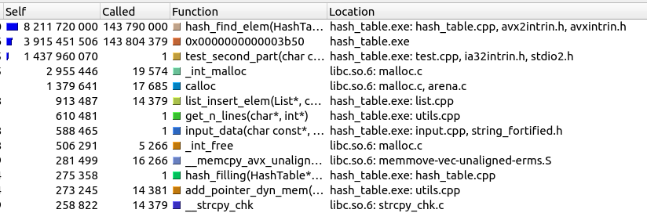

Приведем итоговую таблицу, которая показывает, окончательное ускорение для нашей программы относительно базовой версии.

| Уровень оптимизации | Время выполнения базовой версии $\cdot 10^6$ | Время выполнения итоговой версии $\cdot 10^6$ | Итоговое ускорение |
|---------------------|----------------------------------------------|-----------------------------------------------|--------------------|
|   `-O0`             |   705.5                                      |   177.2                                       |   4.24             |
|   `-O3`             |   392.4                                      |   103.9                                       |   3.78             |


Оценим результат оптимизации, рассчитав его по следующей формуле:

$$ res = \frac{\text{прирост производительности}}{\text{количество платформозависимых строк кода}} \cdot 1000$$

Итого, результат оптимизации составил $res = \frac{3.78}{20} \cdot 1000 = 189$, что является хорошим значением.
