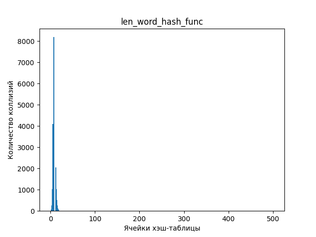
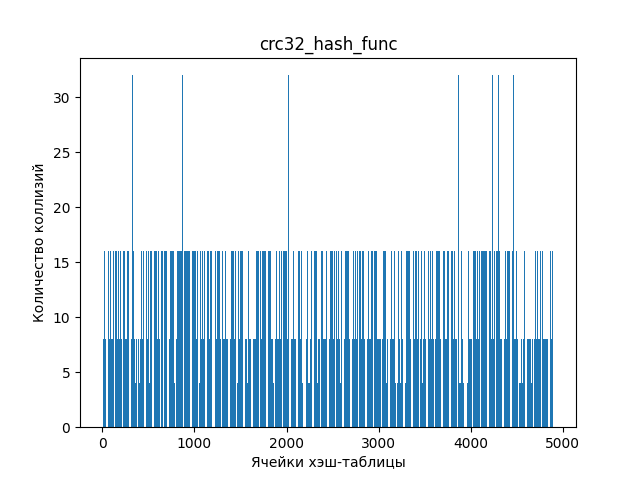

# Исследование оптимизаций кода на примере хэш-таблицы

## Введение

Данный проект состоит из двух частей:
1. Исследовать заселенность хэш-таблицы для определенного набора хэш-функций.
2. Оптимизировать несколько участков кода с наименьшим числом строк кода.

## Скачивание и установка проекта

Для установки программы используются утилиты `make` и `git`.

```CMAKE
    git clone git@github.com:EntryFrager/HashTable.git
    cd HashTable
    make
    ./HashTable.exe
```

> [!IMPORTANT]
>
> Данная программа предназначена для работы на процессорах поддерживающих AVX\AVX2 инструкции (Advanced Vector Extensions).

## Немного про хэш-таблицы

Хеш-таблица — структура данных, реализующая интерфейс ассоциативного массива, а именно, она позволяет хранить пары (ключ, значение) и выполнять три операции: операцию добавления новой пары, операцию удаления и операцию поиска пары по ключу.

Существуют два основных варианта хеш-таблиц: с открытой адресацией и списками. Хеш-таблица является массивом, элементы которого есть пары (хеш-таблица с открытой адресацией) или списки пар (хеш-таблица со списками). Мы будем использовать второй вариант.

Выполнение операции в хеш-таблице начинается с вычисления хеш-функции от ключа. Получающееся хеш-значение играет роль индекса в массиве. Затем выполняемая операция (добавление, удаление или поиск) перенаправляется объекту, который хранится в соответствующей ячейке массива.

Ситуация, когда для различных ключей получается одно и то же хеш-значение, называется коллизией. Такие события не так уж и редки — например, при вставке в хеш-таблицу размером 365 ячеек всего лишь 23 элементов вероятность коллизии уже превысит 50% (если каждый элемент может равновероятно попасть в любую ячейку). Поэтому механизм разрешения коллизий — важная составляющая любой хеш-таблицы.

Хэш-таблица позволяет обрабатывать элемент за O(1). Это является её главным преимуществом перед обычными массивами, списками и деревьями.

> [!NOTE]
>
> Более подробно про хэш-таблицы вы можете прочитать [здесь](https://ru.wikipedia.org/wiki/%D0%A5%D0%B5%D1%88-%D1%82%D0%B0%D0%B1%D0%BB%D0%B8%D1%86%D0%B0).

## Статистические данные для хэш-таблиц

Будем считать хэш-функцию идеальной, если она дает равномерное распределение, и во всех списках хэш-таблицы будет одинаковое количество элементов.

Пусть $Index[m]$ – хеш-таблица с $m$ позициями, в которую занесено $n$ пар (key,
value). Отношение $\alpha = \frac {n} {m}$ называется коэффициентом заполнения хеш-таблицы. Данный коэффициент показывает, сколько будет коллизий в каждом списке хэш-таблицы для идеальной хэш-функции.

Коэффициент заполнения $\alpha$ позволяет судить о качестве хеш-функции: пусть $M = \frac {1} {m} \Sigma_ {i = 0} ^ {m} |*Index[i]|$– средняя длина списков; если `hash(key)` – "хорошая" хеш-функция, то дисперсия $D = \frac {1} {m} \Sigma_ {i = 0} ^ {m - 1} (|M - *Index[i]|) ^ 2 \leq \alpha$. Другими словами, дисперсия есть среднее отклонение длины списков от идеального значения. И мы допускаем, что, если наше отклонение будет меньше идеального значения количества коллизий в одном списке, то наша хэш-функция - "хорошая".

> [!NOTE]
>
> Данная информация взята с этого [сайта](http://algcourse.cs.msu.su/wp-content/uploads/2010/12/Lect13.pdf).

## Первая часть работы

Для исследования заселенности хэш-таблицы были взяты хэш-функции, которые в качестве хэша возвращали:

1. Ноль
2. ASCII код первой буквы слова
3. Длину слова
4. Сумму всех ASCII кодов букв(контрольная сумма)
5. Частное контрольной суммы и длины слова
6. Для пустой строки 0, иначе суммарное значение для rotate right
7. Для пустой строки 0, иначе суммарное значение для rotate left
8. Хэш-функция - `crc32`

Для заполнения хэш-таблицы был взят текст "Евгения Онегина" на английском языке, из которого были удалены все знаки препинания и который был разбит на отдельные слова. Всего слов было `14379`, уникальных из них `3473`.

Ниже приведены графики, отображающие зависимость количества коллизий от номера ячейки.

### 1. Функция, возвращающая ноль

```C
hash_t nul_hash_func (const hash_elem_t elem, int *code_error)
{
    my_assert(elem != NULL, ERR_PTR);

    return 0;
}
```


Все наши слова попали в первую ячейку. На графике это показано соответствующей пикой в нуле. Данное распределение является крайне неэффективным, так как для обработки элемента из данной хэш-таблицы потребуется O(n).

### 2. Функция, возвращающая ASCII код первой буквы слова

```C
hash_t ascii_code_hash_func (const hash_elem_t elem, int *code_error)
{
    my_assert(elem != NULL, ERR_PTR);

    return (hash_t) *elem;
}
```


Из графика видно, что наши слова распределились между ячейками от `65`('A') до `122`('z'). Данная хэш-функция не дает нам желаемого результата, так как данное распределение не сильно отличается от первой хэш-функции.

### 3. Функция, возвращающая длину слова

```C
hash_t len_word_hash_func (const hash_elem_t elem, int *code_error)
{
    my_assert(elem != NULL, ERR_PTR);

    return strlen(elem);
}
```



Из графика видим пику в самом начале. Это обосновано тем, что длины всех слов не больше `20`, и все слова располагаются в первых `20` ячейках. Данная хэш-функция не является "хорошей", так как понятно, что среднее отклонение длины списков от идеального значения сильно больше коэффициента заполнения хеш-таблицы.

### 4. Функция, возвращающая контрольную сумму

```C
hash_t control_sum_hash_func (const hash_elem_t elem, int *code_error)
{
    my_assert(elem != NULL, ERR_PTR);

    hash_t control_sum = 0;

    for (size_t i = 0; elem[i] != '\0'; i++)
    {
        control_sum += elem[i];
    }

    return control_sum;
}
```


На графике мы видим две пики и элементы распределены по большей части хэш-таблицы. Данное распределение лучше, чем все приведенные выше, но все также непригодно для использования.

### 5. Функция, возвращающая частное контрольной суммы и длины слова

```C
hash_t average_value_hash_func (const hash_elem_t elem, int *code_error)
{
    my_assert(elem != NULL, ERR_PTR);

    return (hash_t) control_sum_hash_func(elem, code_error) / strlen(elem);
}
```


На графике видна одна пика. В данном распределении все слова расположились около ячейки с номером `100`. Это обусловлено тем, что контрольная сумма зависит от длины слова и их частное будет давать примерно одинаковое значение.

### 6. Функция, rotate right

```C
hash_t ror_hash_func (const hash_elem_t elem, int *code_error)
{
    my_assert(elem != NULL, ERR_PTR);

    hash_t hash = 0;

    for (size_t i = 0; elem != '\0'; i++)
    {
        hash = ((hash >> 1) | (hash << 63)) ^ elem[i];
    }

    return hash;
}
```


На графике видны пики в начале и конце. Данное распределение более равномерное, нежели первые `5` хэш-функций.

### 7. Функция, rotate left

```C
hash_t rol_hash_func (const hash_elem_t elem, int *code_error)
{
    my_assert(elem != NULL, ERR_PTR);

    hash_t hash = 0;

    for (size_t i = 0; elem[i] != '\0'; i++)
    {
        hash = ((hash << 1) | (hash >> 63)) ^ elem[i];
    }

    return hash;
}
```


Видны две пики в начале графика. Данная функция выдает лучшее распределение, по сравнению с функцией с циклическим сдвигом битов вправо. Но данное распределение все еще является не допустимым к применению.

### 8. Хэш функция - `crc32`

```C
static const hash_t CRC_POLINOM = 0xEDB88320;

hash_t crc32_hash_func (const hash_elem_t elem, int *code_error)
{
    my_assert(elem != NULL, ERR_PTR);

    hash_t crc = 0xffffffff;

    for (size_t i = 0; elem[i] != '\0'; i++)
    {
        crc ^= elem[i];

        for (int bit = 0; bit < 8; bit++)
        {
            if (crc & 1)
            {
                crc = (crc >> 1) ^ CRC_POLINOM;
            }
            else
            {
                crc = crc >> 1;
            }
        }
    }

    return ~crc;
}
```



На графике видны две пики. Среди всех хэш функций данная выдает самое лучшее распределение.

### Load фактор и дисперсия хэш-функций

Load фактор для всех функций был одинаковым и его значение было равно `7.2`.

| Номер хэш-функции | Дисперсия |
|-------------------|-----------|
| 1                 | 103274    |
| 2                 | 4060      |
| 3                 | 15764     |
| 4                 | 544       |
| 5                 | 6441      |
| 6                 | 557       |
| 7                 | 410       |
| 8                 | 396       |

Такие большие значения дисперсии объясняются тем, что среди тех элементов, которые мы записываем в хэш-таблицу, много повторяющихся. Поэтому и такое большое количество коллизий. В дальнейшем исследовании будет использоваться хэш-функция `crc32`.

### Интересные факты про хэш-функции rotate right и rotate left

Воспользуемся сайтом [godbolt](https://godbolt.org/) и посмотрим на ассемблерный код данных функций. Заметим, что циклический сдвиг влево и вправо в ассемблере выполняется при помощи одной команды `rol` и `ror`. Данных функций нет в языках `C/C++`, но они есть в ассемблере. Получается, что компилятор распознает их и преобразует в одну команду.


## Вторая часть работы
