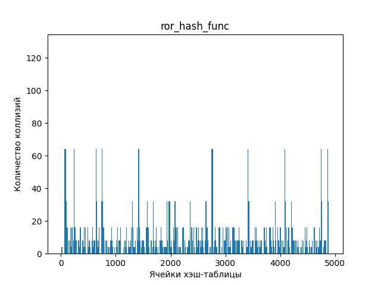
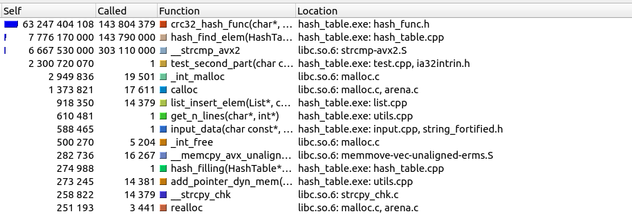
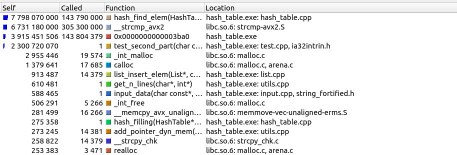
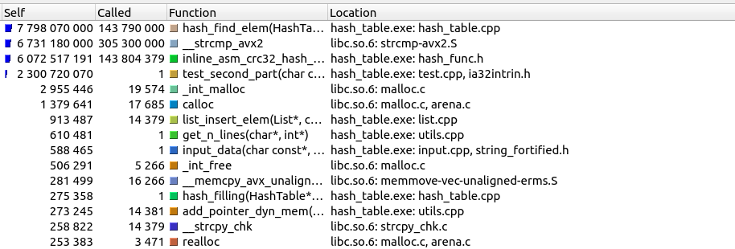
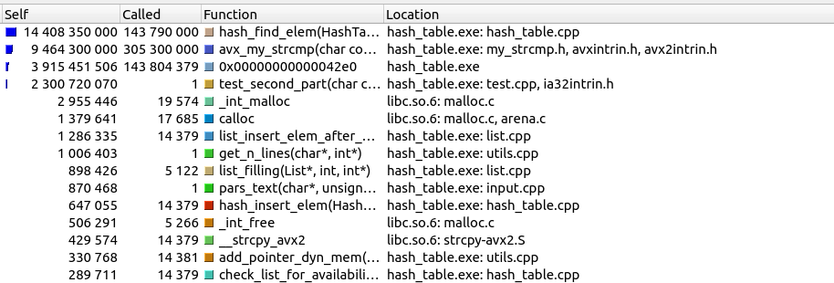
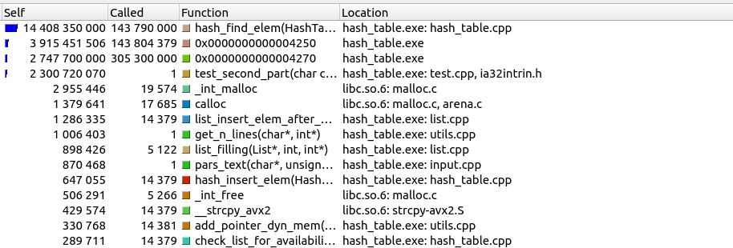

# Исследование оптимизаций кода на примере хеш-таблицы

## Введение

Данный проект состоит из двух частей:
1. Исследовать заселенность хеш-таблицы для определенного набора хеш-функций.
2. Оптимизировать несколько участков кода хеш-таблицы.

## Скачивание и установка проекта

Для установки программы используются утилиты `make` и `git`.

```CMAKE
    git clone git@github.com:EntryFrager/HashTable.git
    cd HashTable
    make
    ./HashTable.exe
```

> [!IMPORTANT]
>
> Данная программа предназначена для работы на процессорах поддерживающих AVX\AVX2 инструкции (Advanced Vector Extensions).

## Немного про хеш-таблицы

Хеш-таблица — структура данных, реализующая интерфейс ассоциативного массива, а именно, она позволяет хранить пары (ключ, значение) и выполнять три операции:

1. Операцию добавления новой пары
2. Операцию удаления
3. Операцию поиска пары по ключу.

Построение хеш-таблицы состоит из трех частей: хеш-функция, преобразование хеша в индекс и обработка коллизий. Сначала давайте рассмотрим, что такое "хорошая" хеш-функция.

### Хорошая хеш-функция

Хеш-функция - функция, осуществляющая преобразование массива входных данных произвольной длины в выходную битовую строку установленной длины, выполняемое определённым алгоритмом. Преобразование, производимое хеш-функцией, называется хешированием. Простыми словами: хеш-функция - это метод, который берет любой объект и вычисляет почти уникальное числовое представление объекта, которое может быть использовано в качестве ключа для последующего поиска.

Хорошая хеш-функция работает быстро. Она дает хорошее равномерное распределение чисел и минимизирует коллизии.

Теоретически, мы можем взять хеш-код, который вычислили, и использовать его в качестве индекса для поиска. Но с этим есть одна проблема. Множество хешей потребует очень большого массива. Вместо этого мы берем все эти возможные хеш-коды и преобразуем их в массив гораздо меньшего размера, применяя остаток от деления на размер хеш-таблицы. Мы можем использовать его, чтобы взять любой хеш-код и заставить его поместиться в массив определенного размера, применив оператор остатка от деления.

Если мы собираемся взять большое количество хеш-кодов и сократить их до меньшего индекса, то неизбежно возникнут коллизии. Давайте посмотрим, как мы справляемся с коллизиями в хеш-таблице.

### Борьба с коллизиями

Поскольку существует бесконечное количество объектов и очень большое, но конечное число хешей и еще меньшее число индексов модуля, иногда мы будем получать два объекта, которые хешируются в один и тот же индекс, это называется коллизией.

Существует несколько решений данной проблемы: метод цепочек и метод двойного хеширования.

#### Метод цепочек

В этом случае каждая ячейка таблицы хешей содержит связанный список всех элементов, которые получаются с помощью той же функции хеширования. Если возникает коллизия, новый элемент добавляется в этот связанный список.

#### Метод двойного хеширования

Используется две хеш-функции, возвращающие взаимно простые натуральные числа. Одна хеш-функция будет возвращать натуральное число, которое будет для нас начальным. То есть первое, что мы сделаем, попробуем поставить наш элемент на полученную их первой хеш-функции позицию в нашем массиве. Но что, если это место уже занято? Именно здесь нам пригодится вторая хеш-функция, которая будет возвращать t — шаг, с которым мы будем в дальнейшем искать место, куда бы поставить наш элемент. Мы будем рассматривать сначала элемент s, потом s + t, затем s + 2*t и т.д. Естественно, чтобы не выйти за границы массива, мы обязаны смотреть на номер элемента по модулю.


### В чем же преимущество хеш-таблиц

Благодаря использованию хеш-функции, хеш-таблица позволяет быстро находить нужный элемент по ключу. Время доступа к элементу в хеш-таблице почти не зависит от размера таблицы, что делает ее очень эффективной для поиска данных(О(1)). Если все же имеются коллизии, то для поиска элемента нужно будет пройтись по списку. В худшем случае это может быть O(n).

> [!NOTE]
>
> Более подробно про хеш-таблицы вы можете прочитать [здесь](https://ru.wikipedia.org/wiki/%D0%A5%D0%B5%D1%88-%D1%82%D0%B0%D0%B1%D0%BB%D0%B8%D1%86%D0%B0).

## Статистические данные для хеш-таблиц

Будем считать хеш-функцию идеальной, если она дает равномерное распределение, и во всех списках хеш-таблицы будет одинаковое количество элементов.

Пусть $Index[m]$ – хеш-таблица с $m$ позициями, в которую занесено $n$ пар (key, value). Отношение $\alpha = \frac {n} {m}$ называется коэффициентом заполнения хеш-таблицы. Данный коэффициент показывает, сколько будет коллизий в каждом списке хеш-таблицы для идеальной хеш-функции.

Коэффициент заполнения $\alpha$ позволяет судить о качестве хеш-функции: пусть $M = \frac {1} {m} \Sigma_ {i = 0} ^ {m} |*Index[i]|$– средняя длина списков; если `hash(key)` – "хорошая" хеш-функция, то дисперсия $D = \frac {1} {m} \Sigma_ {i = 0} ^ {m - 1} (|M - *Index[i]|) ^ 2 \leq \alpha$. Другими словами, дисперсия есть среднее отклонение длины списков от идеального значения. И мы считаем, что, если дисперсия будет меньше идеального значения количества коллизий для одного списка, то наша хеш-функция - "хорошая".

> [!NOTE]
>
> Данная информация взята с этого [сайта](http://algcourse.cs.msu.su/wp-content/uploads/2010/12/Lect13.pdf).

## Первая часть работы

В первой части работы мы будем исследовать статистические данные хеш-таблицы для различных хеш-функций. Для исследования заселенности хеш-таблицы были взяты хеш-функции, которые в качестве хеша возвращали:

1. Ноль
2. ASCII код первой буквы слова
3. Длину слова
4. Сумму всех ASCII кодов букв(контрольная сумма)
5. Частное контрольной суммы и длины слова
6. Для пустой строки 0, иначе суммарное значение для rotate right
7. Для пустой строки 0, иначе суммарное значение для rotate left
8. хеш-функция - `crc32`

Для заполнения хеш-таблицы был взят текст "Евгения Онегина" на английском языке, из которого были удалены все знаки препинания и который был разбит на отдельные слова. Всего слов было `14379`, уникальных из них `3473`.

Ниже приведены графики, отображающие зависимость количества коллизий от номера ячейки.

### 1. Функция, возвращающая ноль

```C
hash_t nul_hash_func (const hash_elem_t elem, int *code_error)
{
    my_assert(elem != NULL, ERR_PTR);

    return 0;
}
```


Все наши слова попали в первую ячейку. На графике это показано соответствующей пикой в нуле. Данное распределение является крайне неэффективным, так как для обработки элемента из данной хеш-таблицы потребуется O(n). Такая хеш-таблица ничем не отличается от обычного массива.

### 2. Функция, возвращающая ASCII код первой буквы слова

```C
hash_t ascii_code_hash_func (const hash_elem_t elem, int *code_error)
{
    my_assert(elem != NULL, ERR_PTR);

    return (hash_t) *elem;
}
```


Из графика видно, что наши слова распределились между ячейками от `65`('A') до `122`('z'). Данная хеш-функция не дает нам желаемого результата, так как данное распределение не сильно отличается от первой хеш-функции.

### 3. Функция, возвращающая длину слова

```C
hash_t len_word_hash_func (const hash_elem_t elem, int *code_error)
{
    my_assert(elem != NULL, ERR_PTR);

    return strlen(elem);
}
```


Из графика видим пику в самом начале. Это обосновано тем, что длины всех слов не больше `20`, и все слова располагаются в первых `20` ячейках. Данная хеш-функция не является "хорошей", так как понятно, что среднее отклонение длины списков от идеального значения сильно больше коэффициента заполнения хеш-таблицы.

### 4. Функция, возвращающая контрольную сумму

```C
hash_t control_sum_hash_func (const hash_elem_t elem, int *code_error)
{
    my_assert(elem != NULL, ERR_PTR);

    hash_t control_sum = 0;

    for (size_t i = 0; elem[i] != '\0'; i++)
    {
        control_sum += elem[i];
    }

    return control_sum;
}
```


Как мы видим из графика, наши элемента расположились до `1750` ячейки. Не трудно понять, что если взять хеш-таблицу размера до `1000`, то данное распределение может показаться хорошим(для этого приведу отдельный график с размером хеш-таблицы `750`), но стоит повысить размер до `2000-4000`, то оно тут же становится непригодным для использования. Все потому, что контрольная сумма имеет ограниченное значения для осмысленных слов. Данное распределение лучше, чем все приведенные выше, но все также непригодно для использования.


### 5. Функция, возвращающая частное контрольной суммы и длины слова

```C
hash_t average_value_hash_func (const hash_elem_t elem, int *code_error)
{
    my_assert(elem != NULL, ERR_PTR);

    return (hash_t) control_sum_hash_func(elem, code_error) / strlen(elem);
}
```


В данном распределении все слова расположились около ячейки с номером `100`. Это обусловлено тем, что контрольная сумма зависит от длины слова и их частное будет давать примерно одинаковое значение. Данное распределение недопустимо к применению, так как поиск элемента в данной хеш-таблице будет проходить за `O(n)`.

### 6. Функция, rotate right

```C
hash_t ror_hash_func (const hash_elem_t elem, int *code_error)
{
    my_assert(elem != NULL, ERR_PTR);

    hash_t hash = 0;

    for (size_t i = 0; elem != '\0'; i++)
    {
        hash = ((hash >> 1) | (hash << 63)) ^ elem[i];
    }

    return hash;
}
```



На графике видны пики в начале и конце. Данное распределение более равномерное, нежели первые `5` хеш-функций.

### 7. Функция, rotate left

```C
hash_t rol_hash_func (const hash_elem_t elem, int *code_error)
{
    my_assert(elem != NULL, ERR_PTR);

    hash_t hash = 0;

    for (size_t i = 0; elem[i] != '\0'; i++)
    {
        hash = ((hash << 1) | (hash >> 63)) ^ elem[i];
    }

    return hash;
}
```


Видны две пики в начале графика. Данная функция выдает лучшее распределение, по сравнению с функцией с циклическим сдвигом битов вправо. Но данное распределение все еще является не допустимым к применению.

### 8. хеш функция - `crc32`

```C
static const hash_t CRC_POLINOM = 0xEDB88320;

hash_t crc32_hash_func (const hash_elem_t elem, int *code_error)
{
    my_assert(elem != NULL, ERR_PTR);

    hash_t crc = 0xffffffff;

    for (size_t i = 0; elem[i] != '\0'; i++)
    {
        crc ^= elem[i];

        for (int bit = 0; bit < 8; bit++)
        {
            if (crc & 1)
            {
                crc = (crc >> 1) ^ CRC_POLINOM;
            }
            else
            {
                crc = crc >> 1;
            }
        }
    }

    return ~crc;
}
```


Данная хеш-функция выдает лучшее распределение среди всех рассмотренных.

### Load фактор и дисперсия хеш-функций

Load фактор для всех функций был одинаковым и его значение было равно `7.2`.

| Номер хеш-функции | Дисперсия |
|-------------------|-----------|
| 1                 | 103274    |
| 2                 | 4060      |
| 3                 | 15764     |
| 4                 | 544       |
| 5                 | 6441      |
| 6                 | 557       |
| 7                 | 410       |
| 8                 | 396       |

Такие большие значения дисперсии объясняются тем, что среди тех элементов, которые мы записываем в хеш-таблицу, много повторяющихся. Поэтому и такое большое количество коллизий. В дальнейшем исследовании будет использоваться хеш-функция `crc32`, так как она выдала лучшее распределение в нашем исследовании.

### Интересные факты про хеш-функции rotate right и rotate left

Воспользуемся сайтом [godbolt](https://godbolt.org/) и посмотрим на ассемблерный код данных функций. Заметим, что циклический сдвиг влево и вправо на ассемблере выполняется при помощи одной команды `rol` и `ror`. Данных функций нет в языках `C/C++`, но они есть в ассемблере. Получается, что компилятор распознает их и преобразует в одну команду.


 ## Вторая часть работы

Во второй части работы мы будем оптимизировать узкие места в нашей программе. Чтобы найти узкие места в нашей программе воспользуемся утилитой `KCachegrind`.

Для заполнения хеш-таблицы воспользуемся тем же самым текстом, что и в первой части работы. В качестве теста хеш-таблицы, была написана отдельная функция, которая вызывает функцию поиск элемента, для всех слов нашего текста `200` раз.

```C
static void test_hash(HashTable *hash_table, char **data, size_t len_data, int *code_error)
{
    assert_hash_table(hash_table);
    my_assert(data != NULL, ERR_PTR);

    for (size_t j = 0; j < 2000; j++)
    {
        for (size_t i = 0; i < len_data; i++)
        {
            HashElemPos hash_elem_pos = {};
            hash_find_elem(hash_table, &hash_elem_pos, data[i], code_error);
        }
    }
}
```

Для каждой оптимизации посчитаем время выполнения программы в тиках процессора, при помощи функции `__rdtsc()`. Более подробно про данную функцию вы можете прочитать [здесь](https://man.netbsd.org/NetBSD-8.1/x86/rdtsc.9).


Для начала запустим `callgrind` для не оптимизированной программы и найдем "узкие" места. Ниже приведен скрин из `KCachegrind`.



### Первая оптимизация

Не трудно увидеть, что наша хеш-функция `crc32` занимает большую часть времени выполнения. Для первой оптимизации, ускорим данную функцию. Для ее оптимизации можно применить несколько вариантов оптимизации:
1. Применить `SIMD` оптимизацию данной хеш-функции (`sse_crc32_hash_func`)
2. Написать данную функцию на ассемблере и вызывать ее (`asm_crc_32_hash_func`)
3. Сделать ассемблерную вставку в код (`inline_asm_crc_32_hash_func`)

Рассмотрим каждый вариант и выберем тот, что дает лучшее ускорение.

#### Первый вариант

```C
hash_t sse_crc32_hash_func (const hash_elem_t elem, int *code_error)
{
    my_assert(elem != NULL, ERR_PTR);

    hash_t hash = 0;

    for (size_t i = 0; elem[i] != '\0'; i++)
    {
        hash = _mm_crc32_u8(hash, elem[i]);
    }

    return hash;
}
```


#### Второй вариант

```assembly
asm_crc32_hash_func:
    push rbp
    mov rbp, rsp

    xor rax, rax
    mov eax, 0xffffffff

    jmp .if_loop
.loop:
    crc32 eax, byte [rdi]
    inc rdi

.if_loop:
    cmp byte [rdi], 0
    ja .loop

    mov rsp, rbp
	pop rbp

    ret
```



#### Третий вариант

```C
hash_t inline_asm_crc32_hash_func (const hash_elem_t elem, int *code_error)
{
    my_assert(elem != NULL, ERR_PTR);

    hash_t hash = 0;

    __asm__ ("xor rax, rax                  \n\t"
             "mov eax, 0xffffffff           \n\t"
             "jmp .if_loop                  \n\t"
             ".loop:                        \n\t"
             "crc32 eax, byte ptr [%[elem]] \n\t"
             "inc %[elem]                   \n\t"
             ".if_loop:                     \n\t"
             "cmp byte ptr [%[elem]], 0     \n\t"
             "ja .loop                      \n\t"
             "mov %[hash], eax              \n\t"
             :[hash] "=m"(hash)
             :[elem] "d"(elem)
             :"%rax");

    return hash;
}
```



#### Итоги для первой оптимизации

Ниже приведена таблица, которая показывает, во сколько раз ускорилась программа для каждого варианта первой оптимизации относительно версии без оптимизаций.

| Вариант оптимизации | Время выполнения программы без `-O3` | Время выполнения программы с `-O3` | Ускорение без `-O3` | Ускорение с `-O3` |
|---------------------|--------------------------------------|------------------------------------|---------------------|-------------------|
| `SIMD` оптимизация  |   | | | |
|Функция на ассемблере|   | | | |
|Ассемблерная вставка |   | | | |

Из таблицы видно, что лучшей оптимизацией является второй вариант. В качестве первой оптимизации для нашей хеш-функции берем функцию на ассемблере. Она дает нам ускорение в `3.11` раз относительно версии без оптимизаций.

### Вторая оптимизация

С первого скрина для версии без оптимизации видно, что после хеш-функции, узким местом является функция `strcmp`. Для оптимизации `strcmp` применим два варианта и выберем из них наилучший:

1. Применить `SIMD` оптимизацию данной хеш-функции (`avx_my_strcmp`)
2. Сделать ассемблерную вставку в код (`inline_asm_my_strcmp`)

#### Первые вариант

```C
int avx_my_strcmp (const char *str_1, const char *str_2)
{
    __m256i s1 = _mm256_loadu_si256((const __m256i*) str_1);
    __m256i s2 = _mm256_loadu_si256((const __m256i*) str_2);

    return ~(_mm256_movemask_epi8(_mm256_cmpeq_epi8(s1, s2)));
}
```



#### Второй вариант

```C
int inline_asm_my_strcmp (const char *str_1, const char *str_2)
{
    int result = 0;

    __asm__("vmovdqu ymm1, ymmword ptr [rdi]\n\t"
            "vpcmpeqb ymm0, ymm1, ymmword ptr [rsi]\n\t"
            "vpmovmskb %[result], ymm0\n\t"
            "xor %[result], 0xffffffff\n\t"
            :[result]"=&r"(result)
            ::"%ymm0", "%ymm1", "%rax");

    return result;
}
```



#### Итоги для второй оптимизации

Ниже приведена таблица, которая показывает, во сколько раз ускорилась программа для каждого варианта второй оптимизации относительно версии после первой оптимизации.

| Вариант оптимизации | Время выполнения программы без `-O3` | Время выполнения программы с `-O3` | Ускорение без `-O3` | Ускорение с `-O3` |
|---------------------|--------------------------------------|------------------------------------|---------------------|-------------------|
| `SIMD` оптимизация  |   | | | |
|Ассемблерная вставка |   | | | |

Из таблицы видно, что лучшей оптимизацией является второй вариант. В качестве второй оптимизации для функции сравнения строк берем функцию с ассемблерной вставкой. Она дает нам ускорение в `3.11` раз.

### Вывод
